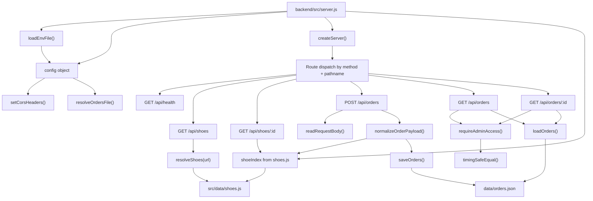
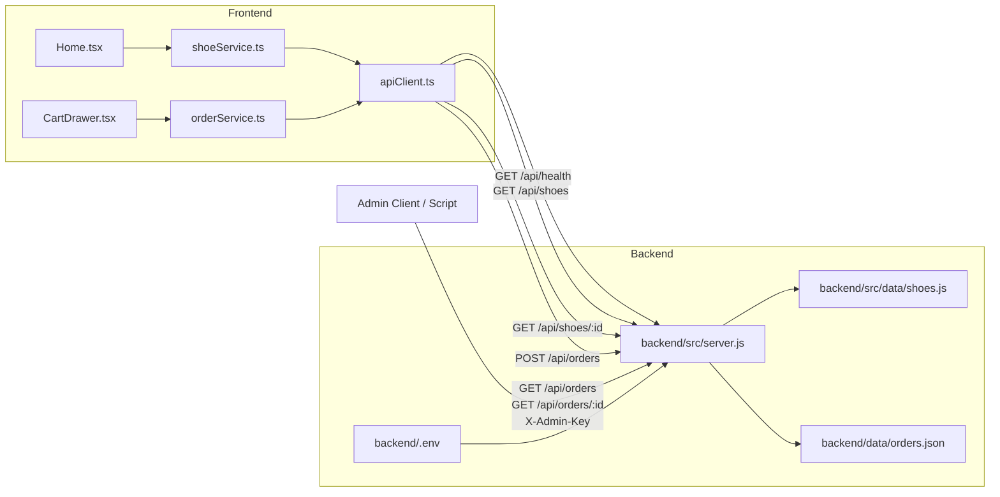
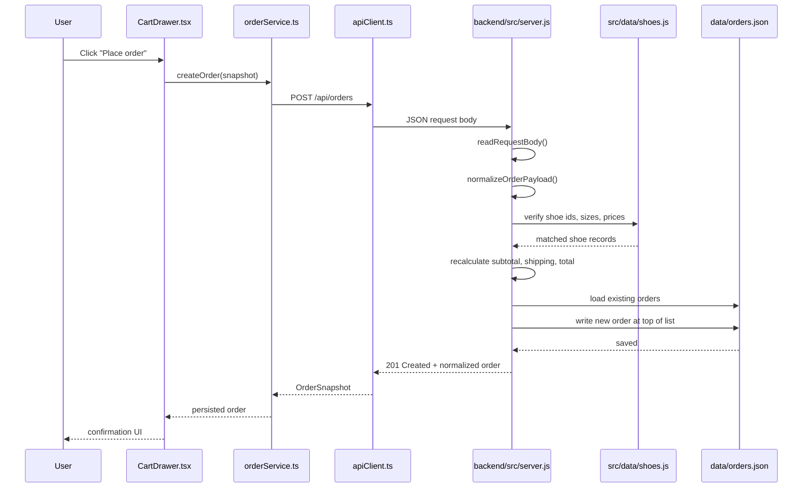
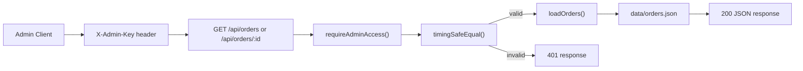

# Velosnak Backend Plan

This document describes the current backend shape, how the frontend connects to it, and the next implementation steps for turning the local API into a cleaner production-ready service.

## Purpose

- Serve shoe catalog data to the storefront.
- Accept order submissions and recalculate totals on the server.
- Protect order read access behind an admin key.
- Persist orders to disk for local development and handoff.

## Current Backend Scope

Core entrypoint:

- `backend/src/server.js`

Current data sources:

- `backend/src/data/shoes.js` for catalog data
- `backend/data/orders.json` for persisted orders
- `backend/.env` for runtime config

Current frontend clients:

- `src/services/apiClient.ts`
- `src/services/shoeService.ts`
- `src/services/orderService.ts`
- `src/pages/Home.tsx`
- `src/components/CartDrawer.tsx`

## Visual Backend Build

### 1. Backend Structure Map

This graph shows how the current backend is built today. Even though most logic lives in one file, the runtime responsibilities are still separable into config, routing, validation, catalog lookup, auth, and persistence.



## Connection Graph



### 2. Order Request Sequence

This sequence diagram shows the most important backend path: how an order moves from the storefront into backend validation and file storage.



### 3. Admin Read Access Graph

This graph shows the protected branch for reading orders back out of storage.



## Runtime Flow

### Catalog Read Flow

1. `Home.tsx` asks `shoeService.ts` for shoes.
2. `shoeService.ts` calls `apiClient.ts` when `VITE_API_BASE_URL` is configured.
3. `apiClient.ts` sends `GET /api/shoes` or `GET /api/shoes/:id`.
4. `backend/src/server.js` filters against `src/data/shoes.js`.
5. The backend returns normalized JSON to the frontend.

### Order Create Flow

1. `CartDrawer.tsx` builds an order snapshot on the client.
2. `orderService.ts` sends `POST /api/orders`.
3. `backend/src/server.js` validates the payload.
4. The backend resolves each item against `shoeIndex` from `src/data/shoes.js`.
5. The backend recalculates subtotal, shipping, and total.
6. The backend creates a server order id and timestamp.
7. The backend writes the final order to `backend/data/orders.json`.
8. The created order is returned to the frontend and cached in local storage.

### Admin Read Flow

1. An admin client sends `GET /api/orders` or `GET /api/orders/:id`.
2. The request must include `X-Admin-Key`.
3. The backend compares the header against `ADMIN_API_KEY` using `timingSafeEqual`.
4. On success, the backend reads `backend/data/orders.json` and returns the requested data.

## Route Inventory

| Method | Route | Purpose | Auth |
| --- | --- | --- | --- |
| `GET` | `/api/health` | Health check and timestamp | None |
| `GET` | `/api/shoes` | List shoes with optional filters | None |
| `GET` | `/api/shoes/:id` | Get one shoe by id | None |
| `POST` | `/api/orders` | Create a validated order | None |
| `GET` | `/api/orders` | Read all stored orders | `X-Admin-Key` |
| `GET` | `/api/orders/:id` | Read one stored order | `X-Admin-Key` |

## Configuration

Environment values already supported:

- `PORT`
- `HOST`
- `CORS_ORIGIN`
- `ORDERS_FILE`
- `ADMIN_API_KEY`

Frontend dependency:

- `VITE_API_BASE_URL` must point at the backend base URL for live API use.

## Strengths In The Current Design

- Server recalculates order pricing instead of trusting client totals.
- Admin read endpoints are isolated from public create endpoints.
- The backend can run without external services.
- Local persistence is simple enough for demos and handoff.
- Private network and loopback CORS handling already exists.

## Current Constraints

- All route handling is in one file.
- Catalog data is static and in-memory.
- Orders are persisted to a JSON file instead of a database.
- There is no structured logging, rate limiting, or request tracing.
- Admin access is a single shared API key.
- No test coverage exists for backend routes or validation logic.

## Implementation Plan

### Phase 1: Stabilize The Current Service

- Split `server.js` into route handlers, config, validation, and persistence modules.
- Add backend tests for health, shoe listing, order validation, and admin auth.
- Introduce a shared response format for errors and success payloads.

### Phase 2: Improve Data Layer

- Move order read/write logic into a repository module.
- Add a storage interface so JSON can later be replaced with SQLite or Postgres.
- Add catalog query helpers instead of filtering directly inside the route layer.

### Phase 3: Tighten Security And Operations

- Add rate limiting on `POST /api/orders`.
- Add request ids and structured logs.
- Replace shared admin key auth with user-based admin auth if the app grows.
- Add stricter CORS environment validation for deployment environments.

### Phase 4: Prepare For Production

- Add database-backed order storage.
- Add inventory and stock mutation rules.
- Add metrics, log shipping, and deployment health checks.
- Add CI checks for backend tests before release.

## Recommended File Split

Suggested target structure:

```text
backend/
  src/
    server.js
    config/
      env.js
    routes/
      healthRoutes.js
      shoeRoutes.js
      orderRoutes.js
    services/
      orderService.js
      shoeService.js
    repositories/
      orderRepository.js
      shoeRepository.js
    utils/
      cors.js
      http.js
      validation.js
```

## Priority Next Steps

1. Extract backend logic from `server.js` into route and service modules.
2. Add route-level tests for `POST /api/orders` and admin order retrieval.
3. Replace JSON persistence with a repository abstraction.
4. Add structured logging around request start, validation failure, and file write failure.
